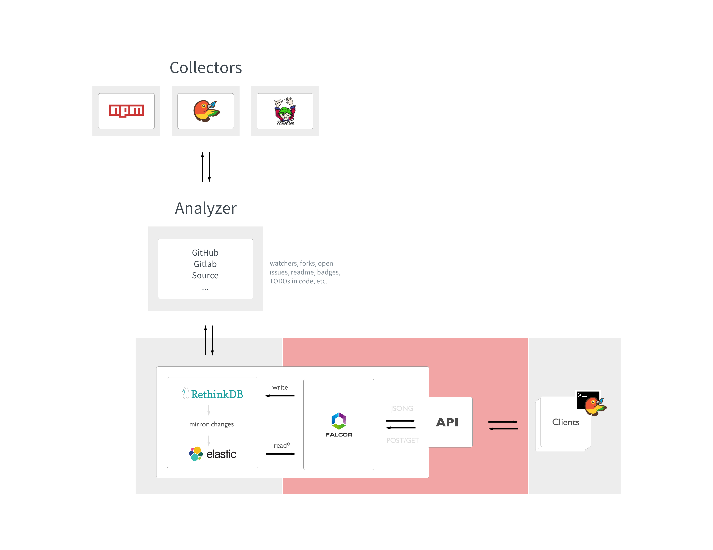

# Architecture

The `package-registry` consists of three to four parts that are as much decoupled as possible,
so that a change of technologies for each part is entirely possible. The registry's core are two databases: RethinkDB
and elasticsearch. Every write goes to RethinkDB (primary DB) and every change is automaticlly replicated to elasticsearch.
Reads are (almost) always done through elasticsearch. The actual data is provided by different collectors, which push each
package into a queue. Analyzers process every packages in the queue and write metadata into the databases.
Clients can access the registry via Falcor, which provides JSON Graph resonses via simple requests. Those requests can/will stay
the same no matter how the rest of the registry changes.

- Collectors
- Queue
- Analyzers
- Databases
- Falcor / Client API

##Collectors   
Besides the possibility to "manually" create new packages, collectors provide the biggest amount of packages, by regularly scraping known sources such as npm, the Bower registry or composers packagist. Collectors push packages into the analyzing queue and provide only a minimal set of metadata (name, url, repo).

### Queue   
The queue is kind of a turnstile that holds every package as a separate job. Created by collectors the queue's jobs are processed by a `general-analyzer` that decides how to further process a package based on its source and url. Inside the queue every package/job is already typed by source, so a package that was collected from Bower will have a `type` of `bower` at any time in the queue and later inside the databases.

##Analyzers   
